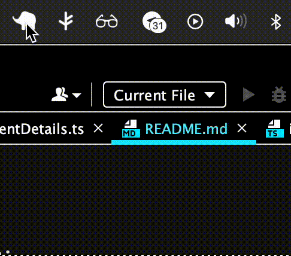
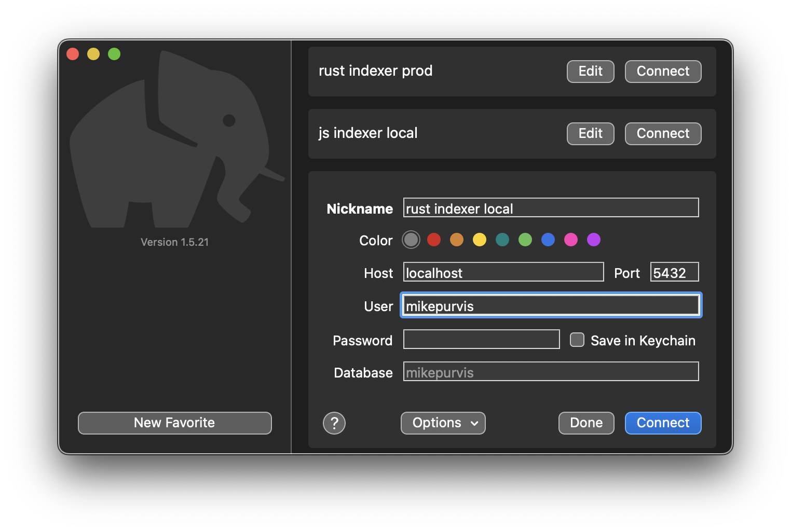
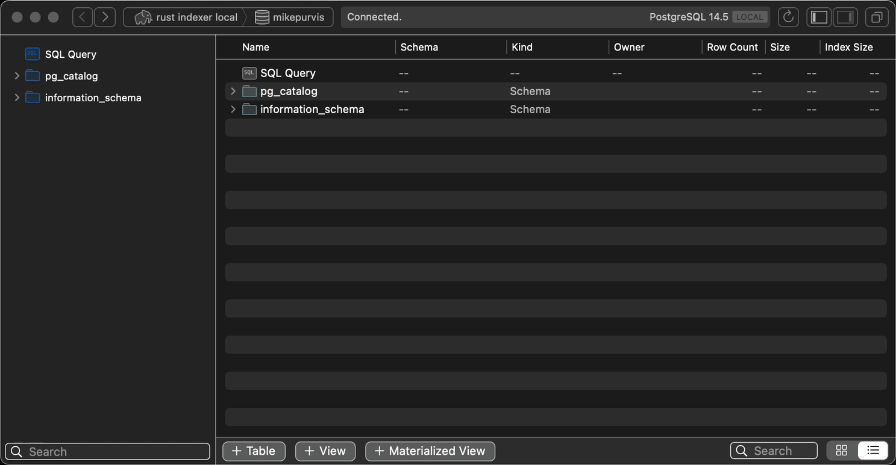
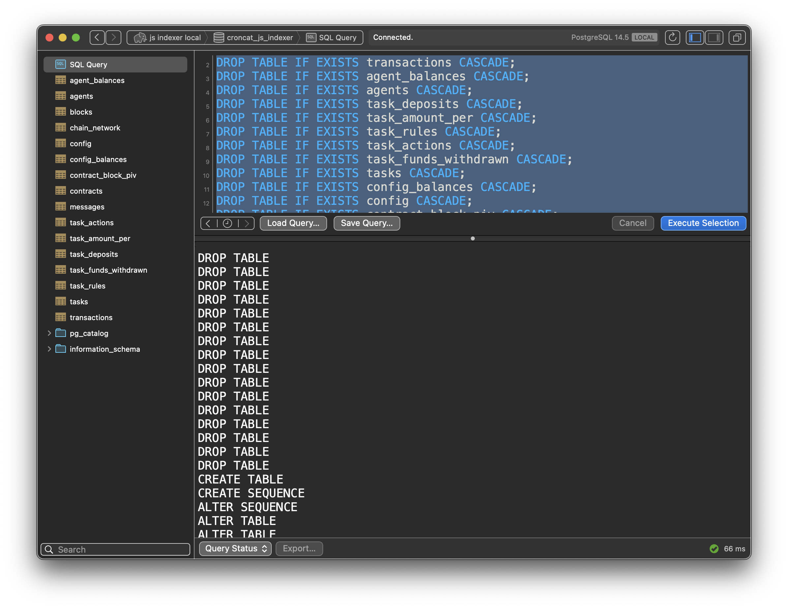

# CronCat Indexer Sweep

This project uses CosmJS to store database entries based on block heights.
This will be used in tandem with the Rust Indexer for CronCat located here:

https://github.com/CronCats/croncat-indexer

**Why are there two indexers?**

The Rust indexer's job is to quickly and efficiently save block and transaction information as it comes in live. To get the "most live" blocks, it uses websockets with a polling fallback.

The Rust indexer should never be slowed down by doing additional requests. That's where this repo comes in, as it "sweeps" through the ingested block info and saves details about the smart contract state (at a given height) as well as some protocol-level details like native balances.

## Getting set up locally

This will be written for folks on a Mac, but it should be easy to follow on other operating systems, too.

### 1. Postgres on your machine

An easy way is to get this small app:

https://postgresapp.com/downloads.html

This is a very light program, and all we'll really do is turn it off and on as we wish.

### 2. Get Postico (db user interface)

Now we'll want to get something like Postico, so we can query and interact with our database.

https://eggerapps.at/postico2

For your local postgres database, a default username and password will likely be your account name with a blank password.

### 3. Create `croncat_indexer` database

You can use the UI from Postico to create a `croncat_indexer` database and ensure you're logging in and connecting as expected.

### 4. Create tables from schema file

In this project there's a `schema` directory that has one file, `schema.sql` which contains the tables we'll want to create.

Copy and paste the entire file into Postico's **SQL Query** tab:

Select all (Cmd + A) and execute (Cmd + Return)

You should see a screen like this:

**Note**: it's typically a good idea to scroll down through the lower pane showing logs like "DROP TABLE" to review whether there were any issues or warnings when you ran all the commands.

### 5. Copy `.env.template` » `.env`

Copy the file and modify with your database username and password, the chain ID, etc.

The `SETTINGS` environment variable is kind of funny, where it's a JSON object. You might use [Boop](https://github.com/IvanMathy/Boop) to help make this readable.

### Build and run

    npm run build && npm run start
